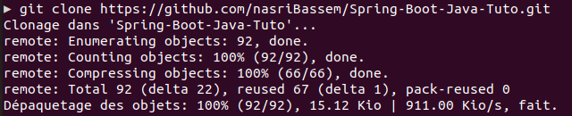
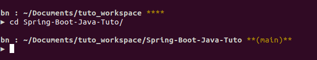
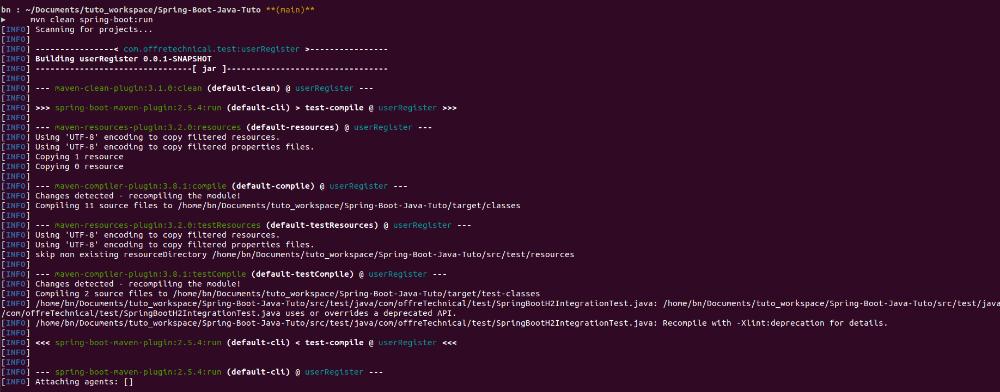
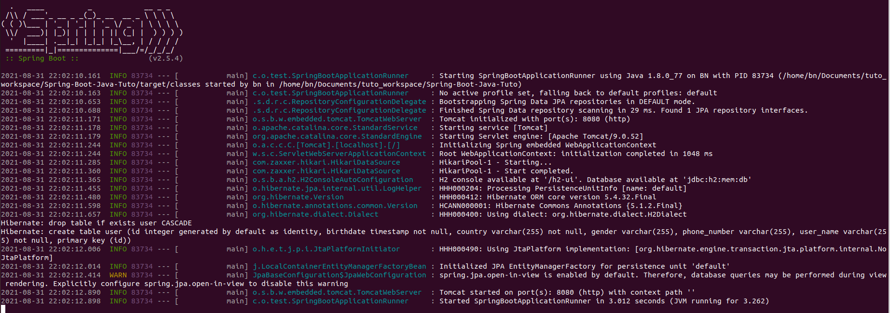

# Spring-Boot-Java-Tuto
User Registration example with Spring Boot, H2 , Junit ..

## Things to do
1. Clone this repository:
    ```
    git clone https://github.com/nasriBassem/Spring-Boot-Java-Tuto.git
    ```
2. Go to your folder:
    ```
    cd Spring-Boot-Java-Tuto
    ```
3. Run the application by this command:
    ```
    mvn clean spring-boot:run
    ```

## Screen shot
Clone :  


Cd :  


SpringBootRun :  



